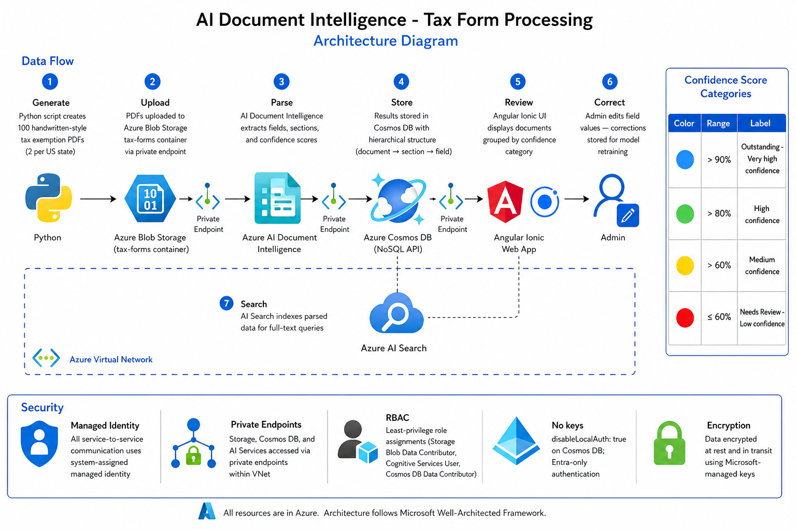

# AI Document Intelligence — Tax Form Processing

End-to-end Azure solution that generates, parses, and reviews 100 handwritten-style tax exemption PDF forms across all 50 US states using **Azure AI Document Intelligence**, stores results in **Cosmos DB**, and provides an **Angular Ionic review portal** with human-in-the-loop corrections.

Built for **Garmin International, Inc.** as the purchaser entity.

---

## Live Application URLs

| Resource | URL |
|----------|-----|
| **UI Portal** | [https://ui-taxforms.azurewebsites.net](https://ui-taxforms.azurewebsites.net) |
| **API Backend** | [https://api-taxforms.azurewebsites.net](https://api-taxforms.azurewebsites.net) |
| **Swagger API Docs** | [https://api-taxforms.azurewebsites.net/docs](https://api-taxforms.azurewebsites.net/docs) |
| **ReDoc API Docs** | [https://api-taxforms.azurewebsites.net/redoc](https://api-taxforms.azurewebsites.net/redoc) |
| **Health Check** | [https://api-taxforms.azurewebsites.net/health](https://api-taxforms.azurewebsites.net/health) |
| **GitHub Repository** | [https://github.com/csdmichael/AI-Document-Intelligence](https://github.com/csdmichael/AI-Document-Intelligence) |

---

## Architecture Diagram



### Key Components

| Component | Azure Service | Purpose |
|-----------|--------------|---------|
| PDF Storage | Blob Storage (`aistoragemyaacoub`) | Store 100 tax exemption PDFs |
| Form Parsing | AI Document Intelligence | Extract fields, sections, confidence scores |
| Results DB | Cosmos DB (`cosmos-ai-poc`) | Store parsed results + human corrections |
| Search | Azure AI Search | Full-text search across parsed documents |
| API | App Service (Python) | FastAPI backend with CRUD operations |
| UI | App Service (Node.js) | Angular Ionic review portal |
| Security | Private VNet + Managed Identity | Zero-trust network + keyless auth |
| AI Agent | AI Foundry (`001-ai-proj`) | Orchestration and intelligent processing |

### Data Flow

1. **Generate**: Python script creates 100 handwritten-style tax exemption PDFs (2 per US state)
2. **Upload**: PDFs uploaded to Azure Blob Storage `tax-forms` container via private endpoint
3. **Parse**: AI Document Intelligence extracts fields, sections, and confidence scores
4. **Store**: Results stored in Cosmos DB with hierarchical structure (document → section → field)
5. **Review**: Angular Ionic UI displays documents grouped by confidence category (Blue/Green/Yellow/Red)
6. **Correct**: Admin edits field values — corrections stored for model retraining
7. **Search**: AI Search indexes parsed data for full-text queries

---

## Prerequisites

- **Azure CLI** >= 2.60 — `az --version`
- **Python** >= 3.12 — `python --version`
- **Node.js** >= 20 — `node --version`
- **Azure Subscription** with existing resources (see below)

### Existing Azure Resources

| Resource | ID / Endpoint |
|----------|--------------|
| Blob Storage | `/subscriptions/86b37969-9445-49cf-b03f-d8866235171c/resourceGroups/ai-myaacoub/providers/Microsoft.Storage/storageAccounts/aistoragemyaacoub` |
| AI Services | `https://001-ai-poc.cognitiveservices.azure.com/` |
| AI Foundry | `https://001-ai-poc.services.ai.azure.com/api/projects/001-ai-proj` |
| Cosmos DB | `/subscriptions/86b37969-9445-49cf-b03f-d8866235171c/resourceGroups/ai-myaacoub/providers/Microsoft.DocumentDb/databaseAccounts/cosmos-ai-poc` |

---

## Setup Commands

### 1. Clone and install dependencies

```bash
git clone <this-repo>
cd AI-Document-Intelligence

# Python dependencies (for scripts)
python -m venv .venv
.venv\Scripts\activate   # Windows
# source .venv/bin/activate  # Linux/macOS
pip install -r requirements.txt

# API dependencies
pip install -r api/requirements.txt

# UI dependencies
cd ui && npm install && cd ..
```

### 2. Configure environment

All configuration is stored in YAML files under `config/`:

| File | Purpose |
|------|---------|
| `config/azure_resources.yaml` | Azure resource IDs, endpoints, account names |
| `config/doc_intelligence.yaml` | Model ID, confidence thresholds, section mapping, retraining settings |
| `config/app_settings.yaml` | API server, UI, form generation settings |

To override any value for local development, copy `.env.example` to `.env`:

```bash
copy .env.example .env
# Environment variables override YAML defaults (see .env.example for mapping)
```

### 3. Azure login and managed identity setup

```bash
# Login to Azure
az login

# Set subscription
az account set --subscription 86b37969-9445-49cf-b03f-d8866235171c

# Assign yourself Storage Blob Data Contributor for local dev
az role assignment create \
  --assignee $(az ad signed-in-user show --query id -o tsv) \
  --role "Storage Blob Data Contributor" \
  --scope /subscriptions/86b37969-9445-49cf-b03f-d8866235171c/resourceGroups/ai-myaacoub/providers/Microsoft.Storage/storageAccounts/aistoragemyaacoub

# Assign yourself Cognitive Services User for Document Intelligence
az role assignment create \
  --assignee $(az ad signed-in-user show --query id -o tsv) \
  --role "Cognitive Services User" \
  --scope /subscriptions/86b37969-9445-49cf-b03f-d8866235171c/resourceGroups/ai-myaacoub
```

### 4. Provision infrastructure (AI Search, App Service)

Note: Cosmos DB (`cosmos-ai-poc`) already exists — the Bicep template references it, not re-creates it.

```bash
# Preview what will be deployed
az deployment group what-if \
  --resource-group ai-myaacoub \
  --template-file infra/main.bicep \
  --parameters location=eastus

# Deploy
az deployment group create \
  --resource-group ai-myaacoub \
  --template-file infra/main.bicep \
  --parameters location=eastus
```

### 5. Assign Cosmos DB RBAC for local development

```bash
# Get your principal ID
PRINCIPAL_ID=$(az ad signed-in-user show --query id -o tsv)

# Cosmos DB Built-in Data Contributor
az cosmosdb sql role assignment create \
  --account-name cosmos-ai-poc \
  --resource-group ai-myaacoub \
  --role-definition-id 00000000-0000-0000-0000-000000000002 \
  --principal-id $PRINCIPAL_ID \
  --scope /
```

### 6. Generate and upload tax forms

```bash
# Generate 100 tax exemption PDFs (2 per state)
python scripts/generate_forms.py

# Create blob container and upload PDFs
python scripts/upload_to_blob.py
```

### 7. Initialize Cosmos DB and parse documents

```bash
# Create database and container
python scripts/setup_cosmos.py

# Parse all 100 tax forms with AI Document Intelligence
python scripts/parse_documents.py
```

### 8. Run locally

```bash
# Terminal 1: Start API backend
python -m api.app

# Terminal 2: Start UI dev server
cd ui && npm start
```

Open `http://localhost:3000` to access the review portal.

### 9. Generate architecture diagram (optional)

```bash
pip install diagrams
# Requires Graphviz: https://graphviz.org/download/
python scripts/generate_architecture.py
```

---

## Project Structure

```
AI-Document-Intelligence/
├── .github/workflows/
│   ├── deploy.yml              # Doc Intelligence solution pipeline (infra + data)
│   ├── deploy-api.yml          # API backend deployment
│   └── deploy-ui.yml           # UI frontend deployment
├── api/
│   ├── __init__.py
│   ├── app.py                  # FastAPI application
│   ├── config.py               # Delegates to config/ loader
│   ├── models.py               # Pydantic request/response models
│   ├── requirements.txt        # API Python dependencies
│   └── Dockerfile
├── config/
│   ├── __init__.py             # Centralized config loader (YAML + env overrides)
│   ├── azure_resources.yaml    # Azure resource IDs, endpoints, account names
│   ├── doc_intelligence.yaml   # Model ID, thresholds, section mapping, retraining
│   └── app_settings.yaml       # API, UI, form generation settings
├── data/                       # Generated PDF forms (gitignored)
├── docs/
│   ├── Architecture.png        # Architecture diagram (generated)
│   ├── architecture.md         # Mermaid architecture diagram source
│   └── Prompts.txt             # Original requirements
├── infra/
│   └── main.bicep              # Azure infrastructure (Search, App Service API+UI, RBAC)
├── scripts/
│   ├── generate_forms.py       # Generate 100 handwritten-style tax PDFs
│   ├── upload_to_blob.py       # Upload PDFs to Azure Blob Storage
│   ├── parse_documents.py      # Parse with AI Document Intelligence
│   ├── setup_cosmos.py         # Initialize Cosmos DB database/container
│   └── generate_architecture.py # Generate PNG architecture diagram
├── ui/
│   ├── src/
│   │   ├── app/
│   │   │   ├── pages/
│   │   │   │   ├── blob-files/
│   │   │   │   │   └── blob-files.page.ts     # Blob files listing (pre-parse)
│   │   │   │   ├── parsed-documents/
│   │   │   │   │   └── parsed-documents.page.ts # Parsed docs grouped by confidence
│   │   │   │   └── document-detail/
│   │   │   │       └── document-detail.page.ts  # Document drill-down with sections
│   │   │   ├── api.service.ts  # API client service
│   │   │   ├── app.component.ts # Main app with side menu & routing
│   │   │   ├── app.routes.ts   # Route definitions
│   │   │   └── models.ts       # TypeScript interfaces
│   │   ├── global.scss         # Global styles & Ionic theming
│   │   ├── index.html          # Entry HTML
│   │   └── main.ts             # Angular bootstrap
│   ├── angular.json
│   ├── package.json
│   ├── proxy.conf.json
│   ├── tsconfig.json
│   ├── tsconfig.app.json
│   └── Dockerfile
├── .env.example                # Environment template
├── .gitignore
├── LICENSE                     # MIT License
├── README.md
└── requirements.txt            # Root Python dependencies
```

---

## Confidence Score Categories

Documents, sections, and fields are color-coded by confidence:

| Category | Score Range | Color | Meaning |
|----------|-----------|-------|---------|
| 🔵 **Blue** | > 90% | `#1565C0` | Outstanding — Very high confidence |
| 🟢 **Green** | > 80% | `#2E7D32` | High confidence |
| 🟡 **Yellow** | > 60% | `#F9A825` | Medium confidence |
| 🔴 **Red** | ≤ 60% | `#C62828` | Needs Review — Low confidence |

### Confidence Roll-Up

1. **Field Level**: Raw confidence from Document Intelligence per extracted key-value pair
2. **Section Level**: Average of all field confidences within the section
3. **Document Level**: Average of all section confidences

---

## Human-in-the-Loop Review Workflow

1. **Browse** → Admin views parsed documents grouped by confidence category
2. **Drill Down** → Click a document to see sections, each with its own confidence badge
3. **Inspect** → Expand a section to see individual fields with extracted values
4. **Correct Fields** → Click "Edit" on any field to enter the corrected value
5. **Correct Images/Diagrams** → Click "Edit" on any extracted image description to fix it
6. **Approve** → Mark the document as approved after review

Corrections are stored in Cosmos DB alongside the original extracted values, maintaining full audit trail with `correctedBy`, `correctedAt` metadata.

---

## Document Intelligence Best Practices

### Accuracy Optimization

1. **Use the right model**: `prebuilt-document` for general form extraction; consider training a **custom model** for state-specific tax forms once you have labeled training data from corrections.

2. **Image quality**: Ensure scanned PDFs are at least **300 DPI**. Use preprocessing (deskew, contrast enhancement) for degraded documents.

3. **Pre-processing pipeline**:
   - Rotate pages to correct orientation
   - Remove background noise and watermarks
   - Enhance contrast for handwritten text
   - Split multi-page documents if needed

4. **Field confidence thresholds**: Use the 4-tier confidence system (Blue/Green/Yellow/Red) to route documents efficiently — auto-approve Blue, quick-review Green, careful review Yellow, manual entry Red.

5. **Region-of-interest (ROI)**: When forms have a consistent layout, define specific regions to extract from, improving accuracy and reducing noise.

### Continuous Improvement (Model Retraining)

1. **Collect corrections**: Every human edit is stored with the original extraction, creating labeled training data.

2. **Training data pipeline**:
   - Export documents with `status: "reviewed"` or `status: "approved"` from Cosmos DB
   - Use corrected values as ground truth labels
   - Minimum **5 labeled samples per form type** for custom model training
   - Target **50+ samples** for production accuracy

3. **Custom model training workflow**:
   ```bash
   # 1. Export labeled data from Cosmos DB
   # 2. Upload to Document Intelligence Studio
   # 3. Label fields in Document Intelligence Studio
   # 4. Train custom model
   # 5. Update parse_documents.py to use custom model ID
   # 6. Re-parse documents and compare confidence scores
   ```

4. **Model versioning**: Tag each model with a version. Compare new model confidence against the baseline before promoting to production.

5. **Feedback loop metrics**:
   - Track correction rate per field (fields corrected / total fields)
   - Track average confidence trend over model versions
   - Alert when correction rate exceeds threshold (e.g., >20% for a field)

### Performance at Scale

1. **Batch processing**: Use async `begin_analyze_document` with polling for large batches. Process up to 15 concurrent requests per S0 tier.

2. **Retry logic**: Implement exponential backoff for 429 (rate limit) and 503 (service unavailable) errors.

3. **Caching**: Cache parsed results in Cosmos DB — don't re-parse documents that haven't changed.

4. **Cost optimization**: Use `prebuilt-read` for text-only extraction, `prebuilt-document` for key-value pairs, and custom models only for high-value form types.

### Security

1. **Managed identity only**: Never use API keys. Use `DefaultAzureCredential` everywhere.
2. **Private endpoints**: Access Document Intelligence through private endpoint within VNet.
3. **Data residency**: Ensure the AI Services resource is in the same region as your data.
4. **Audit logging**: Enable diagnostic settings on the AI Services resource.

---

## GitHub Actions CI/CD

The workflow files at `.github/workflows/` provide three separate pipelines:

### `deploy.yml` — Doc Intelligence Solution (Infra + Data Pipeline)
1. **Provision** — Deploy Bicep infrastructure (Cosmos DB, AI Search, App Service API+UI)
2. **Generate** — Create 100 tax exemption PDFs
3. **Upload** — Push PDFs to Azure Blob Storage
4. **Parse** — Run AI Document Intelligence on all documents
5. **Test** — Smoke tests against health, documents, and stats endpoints

### `deploy-api.yml` — API Backend
- Deploy FastAPI backend to Azure App Service

### `deploy-ui.yml` — UI Frontend
- Build Angular Ionic app and deploy to App Service

> **Note**: All workflows are triggered manually via `workflow_dispatch` only. No automatic triggers on push or pull request.

### Required GitHub Secrets

| Secret | Description |
|--------|-------------|
| `AZURE_CLIENT_ID` | Service principal or federated identity client ID |
| `AZURE_TENANT_ID` | Azure AD tenant ID |
| `AZURE_SUBSCRIPTION_ID` | `86b37969-9445-49cf-b03f-d8866235171c` |

### Setting up OIDC for GitHub Actions

```bash
# Create Azure AD app registration for GitHub Actions
az ad app create --display-name "github-actions-doc-intel"
APP_ID=$(az ad app list --display-name "github-actions-doc-intel" --query [0].appId -o tsv)

# Create service principal
az ad sp create --id $APP_ID

# Create federated credential for GitHub Actions
az ad app federated-credential create --id $APP_ID --parameters '{
  "name": "github-main",
  "issuer": "https://token.actions.githubusercontent.com",
  "subject": "repo:<your-org>/AI-Document-Intelligence:ref:refs/heads/main",
  "audiences": ["api://AzureADTokenExchange"]
}'

# Assign Contributor role on resource group
az role assignment create \
  --assignee $APP_ID \
  --role Contributor \
  --scope /subscriptions/86b37969-9445-49cf-b03f-d8866235171c/resourceGroups/ai-myaacoub
```

---

## Database Design (Cosmos DB)

**Why Cosmos DB**: Tax forms are semi-structured — different states have different fields. Cosmos DB's schemaless JSON storage is ideal for varying document structures, nested sections/fields, and fast reads for the review UI.

- **Database**: `taxforms`
- **Container**: `documents` (partition key: `/state`)
- **Account**: `cosmos-ai-poc` (existing)
- **Throughput**: 400 RU/s (scale as needed)

### Document Schema

```json
{
  "id": "uuid",
  "fileName": "tax_exemption_CA_001.pdf",
  "state": "CA",
  "stateName": "California",
  "blobUrl": "https://aistoragemyaacoub.blob.core.windows.net/tax-forms/...",
  "status": "parsed|reviewed|approved",
  "overallConfidence": 0.85,
  "confidenceCategory": "Green",
  "sections": [
    {
      "sectionName": "Purchaser Information",
      "sectionIndex": 1,
      "sectionConfidence": 0.87,
      "confidenceCategory": "Green",
      "fields": [
        {
          "fieldName": "Company Name",
          "extractedValue": "Garmin International, Inc.",
          "confidence": 0.95,
          "confidenceCategory": "Blue",
          "correctedValue": null,
          "correctedBy": null,
          "correctedAt": null
        }
      ]
    }
  ],
  "parsedAt": "2026-04-28T...",
  "reviewedBy": null,
  "reviewedAt": null
}
```

---

## Managed Identity Role Assignments

All services authenticate via **system-assigned managed identity**. No API keys are used.

| Role | Scope | Purpose |
|------|-------|---------|
| Storage Blob Data Contributor | `aistoragemyaacoub` | Read/write PDFs in blob storage |
| Cognitive Services User | Resource group | Access Document Intelligence API |
| Cosmos DB Built-in Data Contributor | `cosmos-ai-poc` | Read/write parsed documents |
| Search Index Data Contributor | `search-taxforms` | Manage search indexes |

These are provisioned automatically by the Bicep template for the App Service managed identity.

---

## Configuration System

All settings are centralized in the `config/` folder using YAML files. **No values are hardcoded in code files.** The loader in `config/__init__.py` provides a singleton `cfg` object with dot-access.

### Override Priority

1. **Environment variables** (`.env` or system) — highest priority
2. **YAML config files** (`config/*.yaml`) — defaults

### Example Usage in Python

```python
from config import cfg

# Azure resources
endpoint = cfg.cosmos_endpoint           # "https://cosmos-ai-poc.documents.azure.com:443/"
account = cfg.azure.storage.account_name  # "aistoragemyaacoub"

# Document Intelligence
model = cfg.doc_intelligence.model.model_id  # "prebuilt-document"
category = cfg.get_confidence_category(0.85)  # "Green"
section = cfg.get_section_name("Company Name")  # "Purchaser Information"

# App settings
port = cfg.app.api.port  # 8000
customer = cfg.app.forms.customer_name  # "Garmin International, Inc."
```

---

## Customer Demo Walkthrough

> **Presenter**: Michael Yaacoub — Sr Solution Engineer @ Microsoft
> **Duration**: ~20 minutes
> **Audience**: Technical decision makers, IT leaders, developers

### Demo Agenda

1. **Problem Statement** — Why document intelligence matters
2. **Architecture Overview** — Azure services and data flow
3. **Live Demo** — Walk through the application
4. **API & Swagger** — Developer experience
5. **Security & Best Practices** — Enterprise-ready patterns
6. **Q&A**

### 1. Problem Statement (2 min)

#### Talking Points

- Enterprises process **thousands** of tax exemption forms annually
- Manual data entry is **error-prone** (5-10% error rate) and **slow**
- Different US states have **different form layouts** — no single template
- Compliance requires **audit trails** for every correction
- AI can extract data with **80-95% confidence**, but humans still need to review low-confidence results

#### Key Message

> "Azure AI Document Intelligence reduces manual processing time by up to **80%** while maintaining compliance through a human-in-the-loop review workflow."

### 2. Architecture Overview (3 min)

Show the architecture diagram at the top of this README or open `docs/Architecture.png`.

| Feature | Implementation |
|---------|---------------|
| **Zero-trust security** | All services use Managed Identity — no API keys stored anywhere |
| **Private endpoints** | Storage, Cosmos DB, AI Services accessed within VNet |
| **Infrastructure as Code** | Bicep templates provision everything via GitHub Actions |
| **CI/CD** | Three separate GitHub Actions workflows (Infra, API, UI) |
| **Cost efficient** | Free-tier AI Search, B1 App Service, 400 RU/s Cosmos DB |

### 3. Live Demo (10 min)

#### Step 1: Show the UI Portal

1. **Open** the UI at [https://ui-taxforms.azurewebsites.net](https://ui-taxforms.azurewebsites.net)
2. **Point out** the left-side navigation menu (Angular Ionic with responsive split-pane)
3. **Click** "Blob Files" in the menu

#### Step 2: Blob Storage — Raw Documents

> "Here we see the 100 tax exemption PDFs stored in Azure Blob Storage — 2 forms per US state, all generated with realistic handwritten-style data."

- Show the file list with names, sizes, and timestamps
- Explain: "These are the raw PDFs *before* AI processing"

#### Step 3: Parsed Documents — AI Results

1. **Click** "Parsed Documents" in the left menu
2. **Point out the stats bar** at the top:
   - 🔵 Blue (>90%) — Outstanding confidence
   - 🟢 Green (>80%) — High confidence
   - 🟡 Yellow (>60%) — Medium confidence
   - 🔴 Red (≤60%) — Needs manual review

> "AI Document Intelligence processed all 100 forms and categorized them into four confidence tiers. The blue documents can be auto-approved, while red ones require human review."

3. **Click filter tabs** to show filtering by category
4. **Show the table** — file names, states, confidence scores, section/field counts

#### Step 4: Document Drill-Down

1. **Click on a Red document** (low confidence) to show the detail view
2. **Point out**:
   - Document header with overall confidence badge
   - Status (parsed/reviewed/approved)
   - Metadata grid (sections, fields, parsed date)
   - **PPTX files** render inline via Office Online viewer (with Google Docs viewer fallback); PDF files render via the browser's built-in viewer
3. **Expand a section** by clicking it
4. **Show the fields table**:
   - Extracted value from AI
   - Per-field confidence score with color badge
   - Corrected value column (empty until human edits)
5. **Show image/diagram descriptions** — expand a section with images to see AI-extracted descriptions with confidence scores and edit buttons

#### Step 5: Human-in-the-Loop Correction

1. **Click "Edit"** on a low-confidence field
2. **Type a corrected value** and click "Save"
3. **Edit image/diagram descriptions** — click "Edit" on any extracted description under the Images & Diagrams sub-section, correct the text, and save
4. **Point out**: Corrections are stored with audit metadata (`correctedBy`, `correctedAt`)

> "Every correction feeds back into our training pipeline. Once we collect enough labeled data, we train a custom Document Intelligence model to improve accuracy for these specific form types."

4. **Click "Approve Document"** to mark as reviewed

#### Step 6: Show the Confidence System

> "The confidence system works at three levels:
> - **Field level**: Raw AI confidence per extracted value
> - **Section level**: Average of field confidences
> - **Document level**: Average of section confidences
>
> This roll-up gives reviewers an instant visual indicator of which documents need attention."

### 4. API & Swagger Documentation (3 min)

#### Show Swagger UI

1. **Open** [https://api-taxforms.azurewebsites.net/docs](https://api-taxforms.azurewebsites.net/docs)
2. **Walk through the endpoints**:

| Endpoint | Method | Purpose |
|----------|--------|---------|
| `/health` | GET | Service health check |
| `/api/blobs` | GET | List raw PDF files in Blob Storage |
| `/api/documents` | GET | List parsed documents (with filters) |
| `/api/documents/stats` | GET | Confidence category statistics |
| `/api/documents/{id}` | GET | Full document detail with sections/fields |
| `/api/documents/{id}/sections/{idx}/fields/{name}` | PUT | Correct a field value |
| `/api/documents/{id}/sections/{idx}/images/{name}` | PUT | Correct an image/diagram description |
| `/api/documents/{id}/approve` | PUT | Approve a document |

3. **Try the `/api/documents/stats` endpoint** live in Swagger
4. **Show query parameters** on `/api/documents` — filter by `category`, `state`, `status`

> "The API is fully documented with Swagger/OpenAPI. Developers can integrate with any frontend or build automations on top of it."

#### Show ReDoc (optional)

Open [https://api-taxforms.azurewebsites.net/redoc](https://api-taxforms.azurewebsites.net/redoc) for a clean, printable API reference.

### 5. Security & Best Practices (2 min)

| Practice | Implementation |
|----------|---------------|
| **No API keys** | `DefaultAzureCredential` + Managed Identity everywhere |
| **Private endpoints** | Blob Storage, Cosmos DB, AI Services within VNet |
| **RBAC** | Least-privilege roles: Blob Data Contributor, Cognitive Services User, Cosmos Data Contributor |
| **OIDC** | GitHub Actions uses federated identity — no stored secrets for Azure auth |
| **Audit trail** | Every correction stored with `correctedBy`, `correctedAt` metadata |
| **Cosmos DB** | `disableLocalAuth: true` — Entra-only authentication |

#### Cost Breakdown (Approximate)

| Service | Tier | Est. Monthly Cost |
|---------|------|-------------------|
| AI Document Intelligence | S0 | ~$1.50/1000 pages |
| Cosmos DB | 400 RU/s | ~$24 |
| App Service | B1 | ~$13 |
| Static Web App | Free | $0 |
| AI Search | Free | $0 |
| Blob Storage | Hot | ~$0.50 |
| **Total** | | **~$39/month** |

### 6. Q&A Preparation

**Q: How accurate is the AI extraction?**
> With the prebuilt-document model, we see 70-95% accuracy depending on form quality. With a custom-trained model (using corrections as training data), accuracy typically reaches 90-98%.

**Q: Can this handle different form types beyond tax forms?**
> Absolutely. AI Document Intelligence supports invoices, receipts, W-2s, insurance claims, contracts — any structured or semi-structured document. The architecture is the same; you just swap the model.

**Q: How does it scale?**
> The S0 tier supports 15 concurrent requests. For enterprise scale, move to S1 for higher throughput. Cosmos DB scales horizontally by partition key (state). The API runs on App Service which auto-scales.

**Q: What about HIPAA/PII compliance?**
> Azure AI Services are HIPAA-compliant. Data stays within your Azure subscription and region. Private endpoints ensure data never traverses the public internet. All auth is via Entra ID.

**Q: How long does it take to process a document?**
> Typically 2-5 seconds per page. The 100-document batch (100 pages) completes in about 5 minutes with parallel processing.

**Q: What's the retraining workflow?**
> 1. Collect corrections from the review UI (stored in Cosmos DB)
> 2. Export labeled data to Document Intelligence Studio
> 3. Train a custom model with 50+ labeled samples
> 4. Deploy the new model and compare confidence scores
> 5. Promote to production when accuracy improves

### Demo Checklist

Before the demo, verify:

- [ ] UI portal loads at https://ui-taxforms.azurewebsites.net
- [ ] API health check returns 200 at https://api-taxforms.azurewebsites.net/health
- [ ] Swagger loads at https://api-taxforms.azurewebsites.net/docs
- [ ] Parsed documents appear with confidence badges
- [ ] At least one Red document is available for edit demo
- [ ] Field edit and save works
- [ ] Document approve works
- [ ] Left menu navigation works on mobile and desktop

### Follow-Up Resources

- **Presenter LinkedIn**: [linkedin.com/in/michael-yaacoub-7a46436](https://www.linkedin.com/in/michael-yaacoub-7a46436/)

---

## References

### Azure AI Services

- **Azure AI Document Intelligence** — [learn.microsoft.com/azure/ai-services/document-intelligence](https://learn.microsoft.com/azure/ai-services/document-intelligence/)
- **Document Intelligence Models Overview** — [learn.microsoft.com/azure/ai-services/document-intelligence/concept-model-overview](https://learn.microsoft.com/azure/ai-services/document-intelligence/concept-model-overview)
- **Custom Document Intelligence Models** — [learn.microsoft.com/azure/ai-services/document-intelligence/concept-custom](https://learn.microsoft.com/azure/ai-services/document-intelligence/concept-custom)
- **Microsoft Foundry (AI Studio)** — [learn.microsoft.com/azure/ai-studio](https://learn.microsoft.com/azure/ai-studio/)

### Data & Storage

- **Azure Cosmos DB** — [learn.microsoft.com/azure/cosmos-db](https://learn.microsoft.com/azure/cosmos-db/)
- **Azure Cosmos DB for NoSQL** — [learn.microsoft.com/azure/cosmos-db/nosql](https://learn.microsoft.com/azure/cosmos-db/nosql/)
- **Azure Blob Storage** — [learn.microsoft.com/azure/storage/blobs](https://learn.microsoft.com/azure/storage/blobs/)
- **Azure AI Search** — [learn.microsoft.com/azure/search](https://learn.microsoft.com/azure/search/)

### Compute & Hosting

- **Azure App Service** — [learn.microsoft.com/azure/app-service](https://learn.microsoft.com/azure/app-service/)

### Security & Identity

- **Managed Identities for Azure Resources** — [learn.microsoft.com/entra/identity/managed-identities-azure-resources/overview](https://learn.microsoft.com/entra/identity/managed-identities-azure-resources/overview)
- **Azure RBAC Overview** — [learn.microsoft.com/azure/role-based-access-control/overview](https://learn.microsoft.com/azure/role-based-access-control/overview)
- **Azure Private Endpoints** — [learn.microsoft.com/azure/private-link/private-endpoint-overview](https://learn.microsoft.com/azure/private-link/private-endpoint-overview)
- **Azure Identity Client Library for Python** — [learn.microsoft.com/python/api/overview/azure/identity-readme](https://learn.microsoft.com/python/api/overview/azure/identity-readme)

### Infrastructure & DevOps

- **Bicep Overview** — [learn.microsoft.com/azure/azure-resource-manager/bicep/overview](https://learn.microsoft.com/azure/azure-resource-manager/bicep/overview)
- **GitHub Actions for Azure** — [learn.microsoft.com/azure/developer/github/connect-from-azure](https://learn.microsoft.com/azure/developer/github/connect-from-azure)

---

## License

[MIT](LICENSE) — Copyright (c) 2026 Michael Yaacoub at Microsoft
