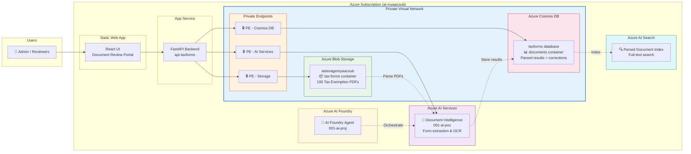

# Architecture Diagram

## AI Document Intelligence - Tax Form Processing



## Data Flow

1. **Generate**: Python script creates 100 handwritten-style tax exemption PDFs (2 per US state)
2. **Upload**: PDFs uploaded to Azure Blob Storage `tax-forms` container via private endpoint
3. **Parse**: AI Document Intelligence extracts fields, sections, and confidence scores
4. **Store**: Results stored in Cosmos DB with hierarchical structure (document → section → field)
5. **Review**: React UI displays documents grouped by confidence category (Blue/Green/Yellow/Red)
6. **Correct**: Admin edits field values — corrections stored for model retraining
7. **Search**: AI Search indexes parsed data for full-text queries

## Confidence Score Categories

| Color | Range | Label |
|-------|-------|-------|
| 🔵 Blue | > 90% | Outstanding - Very high confidence |
| 🟢 Green | > 80% | High confidence |
| 🟡 Yellow | > 60% | Medium confidence |
| 🔴 Red | ≤ 60% | Needs Review - Low confidence |

## Security

- **Managed Identity**: All service-to-service communication uses system-assigned managed identity
- **Private Endpoints**: Storage, Cosmos DB, and AI Services accessed via private endpoints within VNet
- **RBAC**: Least-privilege role assignments (Storage Blob Data Contributor, Cognitive Services User, Cosmos DB Data Contributor)
- **No keys**: `disableLocalAuth: true` on Cosmos DB; Entra-only authentication

> **Note**: To generate a PNG version of this diagram with Azure icons, run:
> ```bash
> pip install diagrams
> python scripts/generate_architecture.py
> ```
> Requires [Graphviz](https://graphviz.org/download/) installed on your system.
